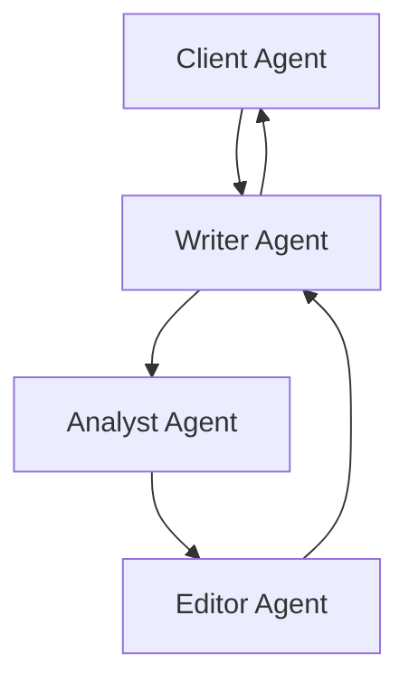

# AI-Powered Earnings Call Analysis System

## Table of Contents
1. [Project Overview](#project-overview)
2. [System Architecture](#system-architecture)
3. [Features](#features)
4. [File Structure](#file-structure)
5. [Installation & Setup](#installation--setup)
6. [Usage Guide](#usage-guide)
7. [Technical Implementation](#technical-implementation)
8. [Challenges & Solutions](#challenges--solutions)
9. [Future Improvements](#future-improvements)

## Project Overview

This project implements an advanced multi-agent AI system for analyzing earnings call transcripts and generating comprehensive investment reports. The system utilizes AutoGen's multi-agent framework to create a collaborative environment where different AI agents work together to produce accurate, detailed, and actionable investment insights.

## System Architecture

The system employs a multi-agent architecture with four specialized agents:

1. **Client Agent**: Acts as the project manager and quality controller
2. **Writer Agent**: Responsible for initial report drafting based on transcript analysis
3. **Analyst Agent**: Performs fact-checking and financial calculations using external data
4. **Editor Agent**: Ensures report quality, clarity, and completeness

### Agent Workflow


## Features

1. **Automated Financial Analysis**
   - Extraction of key financial metrics from earnings call transcripts
   - Automated calculation of financial ratios and metrics
   - Quarter-over-quarter (QoQ) comparison
   - Validation against external financial data

2. **Intelligent Report Generation**
   - Structured report format with standardized sections
   - Financial metrics table with current and previous quarter data
   - Key financial ratios and investment insights
   - Risk assessment with supporting evidence
   - Market sentiment analysis (when applicable)

3. **Data Validation & Quality Control**
   - Cross-verification of transcript data with external financial sources
   - Automated fact-checking and correction
   - Structured feedback loop between agents
   - Quality assurance checks by Editor agent

4. **Flexible Input Processing**
   - Support for various earnings call transcript formats
   - Automatic fiscal year and quarter detection
   - Handling of different company fiscal calendars

## File Structure

```
FYP_Crewai/
├── app.py                 # Streamlit web application
├── autogenAI.py          # Core AutoGen implementation
├── crewAI.py             # CrewAI implementation
├── requirements.txt      # Project dependencies
├── tools/
│   ├── research_tools.py # Financial data retrieval tools
│   └── templates/        # Agent prompt templates
├── Earnings2Insights/    # Transcript storage
│   └── ECTsum/          # Organized by company and quarter
└── saved_reports/        # Generated report storage
```

## Installation & Setup

1. **Environment Setup**
   ```bash
   # Clone the repository
   git clone [repository-url]
   cd FYP_Crewai

   # Create and activate virtual environment (optional but recommended)
   python -m venv venv
   source venv/bin/activate  # On Windows: venv\Scripts\activate

   # Install dependencies
   pip install -r requirements.txt
   ```

2. **API Configuration**
   Create a `.env` file in the root directory:
   ```
   GROQ_API_KEY=your_groq_api_key_here
   OPENAI_API_KEY=your_openai_api_key_here
   ```

3. **Running the Application**
   ```bash
   streamlit run app.py
   ```

## Usage Guide

1. **Starting the Application**
   - Launch the Streamlit app using `streamlit run app.py`
   - The web interface will open in your default browser

2. **Analyzing an Earnings Call**
   - Upload the earnings call transcript
   - Select the desired LLM model
   - Click "Generate Report" to start the analysis

3. **Understanding the Output**
   - The system generates a structured report with:
     - Financial Analysis table
     - Key Financial Ratios table
     - Risk Assessment
     - Market Sentiment Analysis (if applicable)
   - Reports are saved in the `saved_reports/` directory

## Technical Implementation

### Agent System
- Implemented using AutoGen's multi-agent framework
- Each agent has specific roles and responsibilities
- Structured communication protocol between agents
- Feedback loop ensures report accuracy and quality

### Data Processing
- Financial data retrieval using Alpha Vantage API
- Automated ratio calculations
- Quarter detection from filenames and transcript content
- Market sentiment analysis integration

### Report Generation
- Markdown-based report format
- Standardized tables and sections
- Evidence-based risk assessment
- Dynamic content based on available data

## Challenges & Solutions

1. **Prompt Engineering**
   - **Challenge**: Ensuring consistent and accurate agent behavior
   - **Solution**: Iterative prompt refinement, explicit instructions, and structured templates

2. **Financial Data Accuracy**
   - **Challenge**: Discrepancies between transcript and external data
   - **Solution**: Implemented robust fact-checking system and clear feedback mechanisms

3. **Fiscal Year Handling**
   - **Challenge**: Different companies have different fiscal year ends
   - **Solution**: Dynamic quarter detection system considering fiscal calendars

4. **Tool Integration**
   - **Challenge**: Consistent format for tool calls and responses
   - **Solution**: Standardized tool response format and explicit data mapping

5. **Agent Communication**
   - **Challenge**: Ensuring effective information flow between agents
   - **Solution**: Structured feedback templates and clear revision instructions

6. **Data Consistency**
   - **Challenge**: Maintaining consistent financial metrics across reports
   - **Solution**: Centralized calculation in tools and standardized data structures

7. **Market Sentiment**
   - **Challenge**: Handling cases with no news data
   - **Solution**: Conditional section inclusion with clear handling instructions

## Future Improvements

1. **Enhanced Data Sources**
   - Integration with additional financial data providers
   - Support for more financial metrics and ratios

2. **Advanced Analysis**
   - Industry comparison features
   - Historical trend analysis
   - Predictive analytics integration

3. **User Interface**
   - Custom report template options
   - Interactive data visualization
   - Batch processing capabilities

4. **Agent Capabilities**
   - More sophisticated market analysis
   - Enhanced risk assessment
   - Competitor analysis integration

5. **Performance Optimization**
   - Caching mechanisms for financial data
   - Parallel processing for multiple reports
   - Optimized prompt handling

---

*Note: This documentation is maintained and updated regularly. For the latest version or to contribute improvements, please refer to the project repository.* 